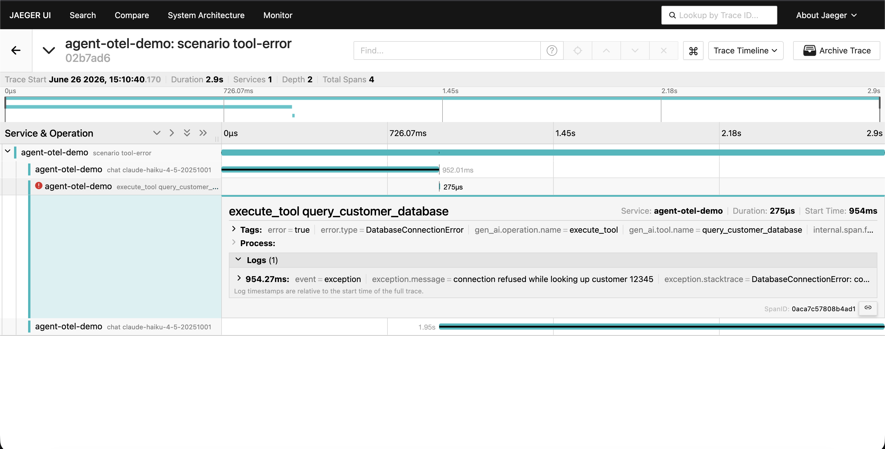

# agent-otel

Standards-compliant OpenTelemetry instrumentation for the Anthropic SDK. Every
model call, tool call, and subagent becomes a proper OTel span with GenAI
semantic-convention attributes, so agent telemetry flows into the observability
stack you already run (Jaeger, Grafana, Datadog, Honeycomb) instead of yet
another vendor dashboard.

## What it's really for: seeing where agents fail

Everyone instruments the happy path. The point of this library is making agent
*failure* legible in a trace: tool errors, runaway loops (the same tool called
over and over without converging), truncation (`stop_reason: max_tokens`), and
refusals all have a recognizable shape in the waterfall.

A runaway loop — the same `search_archive` tool called over and over without
converging, stacked under one trace. This is the stuck-agent shape:


A failed tool call — the `execute_tool` span ends red with an `error.type`, while
the rest of the run stays healthy and the model recovers:



## Library usage

```ts
import Anthropic from "@anthropic-ai/sdk";
import { instrumentAnthropic, withToolSpan } from "agent-otel";

// Bring your own OTel SDK setup (see demo/src/tracing.ts for a minimal one).
const client = instrumentAnthropic(new Anthropic());

// Every messages.create / messages.stream call is now a `chat {model}` span.
const message = await client.messages.create({ model, max_tokens, messages });

// Wrap app-side tool execution so it shows as an `execute_tool {name}` span,
// nested between the model's tool request and its next call.
const result = await withToolSpan("read_file", input, () => readFile(input));
```

### Claude Agent SDK

For agentic runs, wrap the `query()` event stream. Iterating it emits an
`invoke_agent` session span with `chat` turns and `execute_tool` calls, and
**subagents nested under the tool span that spawned them** (the Agent SDK's
`Agent`/`Task` tool), correlated via `parent_tool_use_id`:

```ts
import { query } from "@anthropic-ai/claude-agent-sdk";
import { instrumentAgentQuery } from "agent-otel";

for await (const message of instrumentAgentQuery(query({ prompt, options }))) {
  // ...handle messages as usual; spans are built as a side effect.
}
```


- **Streaming and non-streaming** are both traced; the span stays open until a
  stream is fully consumed and aggregates final usage.
- The library depends only on `@opentelemetry/api` (and treats the Anthropic SDK
  as a peer). The OTel SDK and exporters live in your app, not here.
- **Your OTel setup must register an async context manager**, or every span lands
  in its own trace instead of one connected waterfall. `NodeTracerProvider` does
  this for you; with `BasicTracerProvider`, add an `AsyncLocalStorageContextManager`
  from `@opentelemetry/context-async-hooks` (see `demo/src/tracing.ts`). This is a
  standard OTel requirement, not specific to this library — but it is the most
  common reason instrumented spans look disconnected.

## Privacy by default

Prompts and completions are **never** recorded as span attributes unless you
explicitly opt in with `AGENT_OTEL_CAPTURE_CONTENT=true`. Out of the box, traces
carry structure and metadata only — span names, token counts, tool names, stop
reasons, error types — but no message content. Tool arguments and results follow
the same toggle. That makes the instrumentation safe to turn on in production
without piping user data into your traces, and it is the default precisely so
nobody has to remember to lock it down.

## Demo: a failure-first agent in Jaeger

The `demo/` workspace runs a real multi-turn Claude tool loop and ships its
traces to a local Jaeger.

```bash
# 1. Start Jaeger (UI on :16686, OTLP/HTTP on :4318)
cd demo && docker compose up -d

# 2. From the repo root: build, then run a scenario
npm install
npm run build
export ANTHROPIC_API_KEY=sk-ant-...
npm run demo -- runaway      # or: happy | tool-error | truncation | streaming

# 3. Open http://localhost:16686 and select service "agent-otel-demo"
```

Scenarios:

| Scenario     | What the trace shows                                                        |
| ------------ | -------------------------------------------------------------------------- |
| `happy`      | A clean multi-turn tool loop: chat -> execute_tool -> chat.                 |
| `tool-error` | A tool that throws; its `execute_tool` span ends with ERROR status.        |
| `runaway`    | A non-converging search tool; repeated `execute_tool` spans until the cap. |
| `truncation` | An answer capped at 16 tokens; the chat span shows `max_tokens`.            |
| `streaming`  | A streamed completion; the span stays open until the stream ends.          |

A healthy `happy` run, for contrast — chat turns with `execute_tool` calls
nested in between:


For the Agent SDK layer, `npm run demo:agent` runs a `query()` that delegates to
a subagent; its trace is an `invoke_agent` session with the subagent's turns
nested under the spawning `Agent` tool span.

## Design decisions & tradeoffs

### Why this exists

The standard complaint about LLM-observability tools is "another dashboard,
another silo." `agent-otel` takes the opposite bet: emit plain OpenTelemetry
spans using the GenAI semantic conventions, so agent telemetry lands in whatever
you already run for the rest of your services. Because the spans share trace
context, an agent's `chat` and `execute_tool` spans nest *inside* the request
that triggered them — next to the HTTP handler, the DB query, the queue publish.
You see the agent as part of the system, not in a separate tab.

### Why not Langfuse / LangSmith / Phoenix?

Those are full platforms: hosted UI, evals, datasets, prompt management,
annotation queues, LLM-as-judge. This is deliberately *not* that — it's a thin
instrumentation layer that produces standards-compliant spans and stops there.
They are not really competitors so much as different layers of the stack.

**Reach for `agent-otel` when:**

- You already run an OTel-compatible backend (Jaeger, Tempo, Datadog,
  Honeycomb, Grafana) and want agent traces *there*, correlated with everything
  else, in one pane of glass.
- You can't or won't send prompts/completions to a third-party SaaS (privacy,
  compliance, data residency). Content capture here is off by default and never
  leaves your collector.
- You want to avoid vendor and SDK lock-in. It's just OTel; swap backends, or
  change agent frameworks, and the telemetry layer is unaffected.

**Reach for a platform instead when:**

- You want evals, datasets, prompt versioning, or an LLM-specific UI out of the
  box — product features this does not attempt.
- You do *not* already run an observability stack, and standing one up
  (collector + Tempo/Jaeger + Grafana) is more work than signing up for a SaaS.
- Your priority is fastest time-to-first-insight for a small team, not
  infrastructure that composes with the rest of your services.

The honest summary: a platform is the faster path to LLM-specific *features*;
`agent-otel` is the right call when agent observability should be part of your
existing distributed tracing rather than a parallel system.

### Why not OpenLLMetry / OpenInference?

These are the closest comparisons — like `agent-otel`, [OpenLLMetry][openllmetry]
(Traceloop) and [OpenInference][openinference] (Arize) emit OpenTelemetry spans
for LLM calls, so the "vendor-neutral, lands in your own backend" argument
applies to all three. They are broad: many providers and frameworks, mostly via
auto-instrumentation. `agent-otel` is narrow on purpose, and the differences are
the reasons to pick it:

- **Depth on Anthropic over breadth across providers.** Streaming usage
  aggregation, cache-token attributes, and stop-reason handling track the
  current Anthropic SDK rather than a lowest-common-denominator shape.
- **First-class Claude Agent SDK subagent hierarchy.** The general-purpose
  libraries instrument the model *call*; they don't model an agent framework's
  control flow. `agent-otel` turns the Agent SDK's `query()` event stream into a
  session → turn → tool → **nested-subagent** span tree — the headline feature,
  and the part that's genuinely hard to get from a generic instrumentor.
- **Explicit wrapping over auto-instrumentation** (see below).

If you need many providers or zero-code auto-instrumentation across a large
library surface, those projects are broader and more mature. `agent-otel` trades
that breadth for depth on Claude and the agent span model.

[openllmetry]: https://github.com/traceloop/openllmetry
[openinference]: https://github.com/Arize-ai/openinference

### Key decisions (and the second-order questions they answer)

- **Spans only — no metrics or logs (v1).** "How do I chart token spend or
  error rate?" Derive those in your backend from span attributes (Tempo
  trace-metrics, Datadog, etc.). A metrics signal is a clean future addition;
  starting with spans keeps the surface small and the trace model honest.
- **Explicit wrapping, not module monkey-patching.** Auto-instrumentation that
  patches the SDK at import is magic that breaks quietly across versions. You
  wrap the client and the tool calls yourself, so what's traced is exactly what
  you can see in your code.
- **Content capture off by default.** The privacy-safe default is the whole
  point; opting in is one env var. See [Privacy by default](#privacy-by-default).
- **Vendored, pinned semantic conventions.** The GenAI conventions are still
  evolving and have churned repeatedly; the attribute names are pinned in
  `lib/src/semconv.ts` with a date, so an upstream rename can't silently change
  your span schema.
- **Anthropic-only (v1).** The GenAI conventions are provider-neutral, so
  supporting another provider is mechanical, not architectural — but scoping to
  one provider kept the span model and tests focused.
- **Instrumentation never changes behavior.** If span bookkeeping throws, the
  underlying API call still runs and returns; only real API errors are recorded
  and rethrown. Observability that can break the thing it observes is worse than
  none.

## Status & roadmap

**Working today:** the core instrumentation (streaming and non-streaming chat
spans, tool-execution spans, tool-use events, the content-capture toggle), the
Claude Agent SDK layer (`invoke_agent` session / turn / tool-call spans with
nested subagents), and the failure-first demo with Jaeger. Not yet published to
npm.

**Planned:**

- A Grafana dashboard for failure-at-a-glance: error rate, latency p95/p99 by
  model, token/cost spikes, and a stop-reason breakdown (truncations, refusals).
- An npm release.
