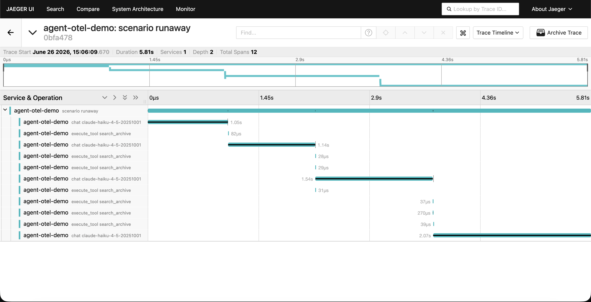
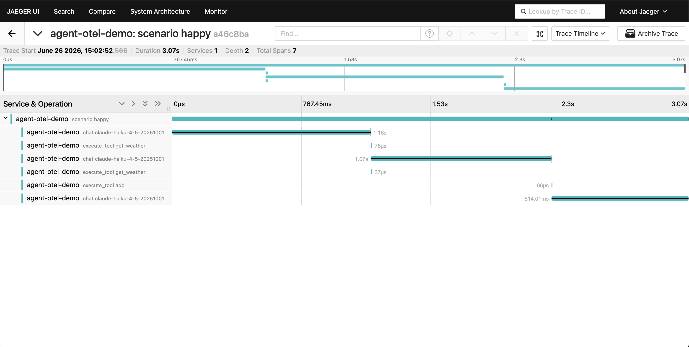
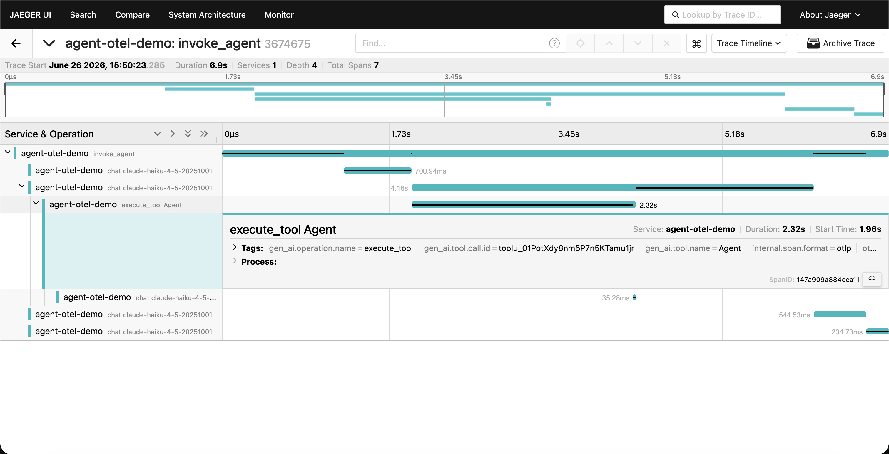

# agent-otel

Standards-compliant OpenTelemetry instrumentation for the Anthropic SDK. Every
model call, tool call, and subagent becomes a proper OTel span with GenAI
semantic-convention attributes, so agent telemetry flows into the observability
stack you already run (Jaeger, Grafana, Datadog, Honeycomb) instead of yet
another vendor dashboard.

## What it's really for: seeing where agents fail

Everyone instruments the happy path. The point of this library is making agent
*failure* legible in a trace: tool errors, runaway loops (the same tool called
over and over without converging), truncation (`stop_reason: max_tokens`), and
refusals all have a recognizable shape in the waterfall.

<!-- LEAD IMAGE: capture and commit docs/jaeger-runaway.png (the runaway-loop
     waterfall — the stuck-agent shape) and reference it here. -->


<!-- Secondary: docs/jaeger-happy.png (a clean multi-turn tool loop). -->


## Library usage

```ts
import Anthropic from "@anthropic-ai/sdk";
import { instrumentAnthropic, withToolSpan } from "agent-otel";

// Bring your own OTel SDK setup (see demo/src/tracing.ts for a minimal one).
const client = instrumentAnthropic(new Anthropic());

// Every messages.create / messages.stream call is now a `chat {model}` span.
const message = await client.messages.create({ model, max_tokens, messages });

// Wrap app-side tool execution so it shows as an `execute_tool {name}` span,
// nested between the model's tool request and its next call.
const result = await withToolSpan("read_file", input, () => readFile(input));
```

### Claude Agent SDK

For agentic runs, wrap the `query()` event stream. Iterating it emits an
`invoke_agent` session span with `chat` turns and `execute_tool` calls, and
**subagents nested under the `Task` span that spawned them**:

```ts
import { query } from "@anthropic-ai/claude-agent-sdk";
import { instrumentAgentQuery } from "agent-otel";

for await (const message of instrumentAgentQuery(query({ prompt, options }))) {
  // ...handle messages as usual; spans are built as a side effect.
}
```



- **Streaming and non-streaming** are both traced; the span stays open until a
  stream is fully consumed and aggregates final usage.
- **Content capture is OFF by default** — prompts and completions are recorded as
  span attributes only when `AGENT_OTEL_CAPTURE_CONTENT=true`. The default is the
  enterprise privacy posture, on purpose.
- The library depends only on `@opentelemetry/api` (and treats the Anthropic SDK
  as a peer). The OTel SDK and exporters live in your app, not here.
- **Your OTel setup must register an async context manager**, or every span lands
  in its own trace instead of one connected waterfall. `NodeTracerProvider` does
  this for you; with `BasicTracerProvider`, add an `AsyncLocalStorageContextManager`
  from `@opentelemetry/context-async-hooks` (see `demo/src/tracing.ts`). This is a
  standard OTel requirement, not specific to this library — but it is the most
  common reason instrumented spans look disconnected.

## Demo: a failure-first agent in Jaeger

The `demo/` workspace runs a real multi-turn Claude tool loop and ships its
traces to a local Jaeger.

```bash
# 1. Start Jaeger (UI on :16686, OTLP/HTTP on :4318)
cd demo && docker compose up -d

# 2. From the repo root: build, then run a scenario
npm install
npm run build
export ANTHROPIC_API_KEY=sk-ant-...
npm run demo -- runaway      # or: happy | tool-error | truncation | streaming

# 3. Open http://localhost:16686 and select service "agent-otel-demo"
```

Scenarios:

| Scenario     | What the trace shows                                                        |
| ------------ | -------------------------------------------------------------------------- |
| `happy`      | A clean multi-turn tool loop: chat -> execute_tool -> chat.                 |
| `tool-error` | A tool that throws; its `execute_tool` span ends with ERROR status.        |
| `runaway`    | A non-converging search tool; repeated `execute_tool` spans until the cap. |
| `truncation` | An answer capped at 16 tokens; the chat span shows `max_tokens`.            |
| `streaming`  | A streamed completion; the span stays open until the stream ends.          |

For the Agent SDK layer, `npm run demo:agent` runs a `query()` that delegates to
a subagent; its trace is an `invoke_agent` session with the subagent's turns
nested under the `Task` span.

## Status & roadmap

**Working today:** the core instrumentation (streaming and non-streaming chat
spans, tool-execution spans, tool-use events, the content-capture toggle), the
Claude Agent SDK layer (`invoke_agent` session / turn / tool-call spans with
nested subagents), and the failure-first demo with Jaeger. Not yet published to
npm.

**Planned:**

- A Grafana dashboard for failure-at-a-glance: error rate, latency p95/p99 by
  model, token/cost spikes, and a stop-reason breakdown (truncations, refusals).
- An npm release.
